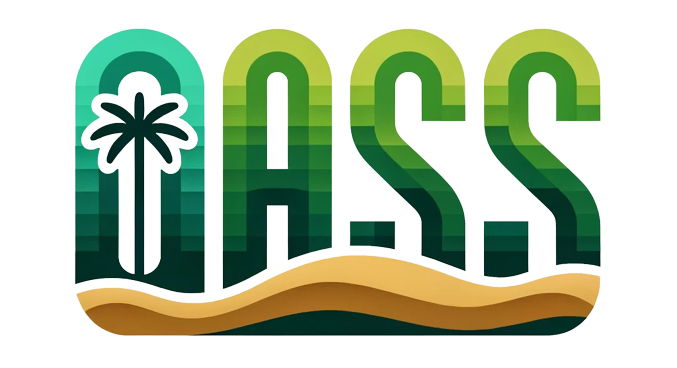

# TheOasis_Portal

The Oiasis of Metahuman

<!-- PROJECT LOGO -->
<br />

<p align="center">
  <a href="https://github.com/Qitu/TheOasis_Portal/">
    
  </a>

  <h3 align="center">Oasis Metahuman</h3>
  <p align="center">
    A configurable metahumen platform
    <br />
    <strong>Discover the demo below</strong>
    <br />
    <br />
    <a href="https://github.com/Qitu/TheOasis_Portal"></a>
  </p>

</p>

## Content

- [Installation](#Installation)
  - [Environment setup](#Environment setup)
  - [Steps](#Steps)
- [Folder Structure](#Folder Structure)
- [Deployment](#Deployment)
- [Open frameworks](#Open frameworks)
- [Contributors](#Contributors)
- [Thanks](#Thanks)

### Installation

###### Environment setup

Intsalled NodeJs Env

###### **Steps**

1. Clone the repo


```sh
git clone https://github.com/Qitu/TheOasis_Portal.git
```

2. Install dependences

```sh
npm install
```

3. Run & Enjoy the project

```sh
npm run start
```


### Folder Structure


```
...
package.json
README.md
config
├── defaultSettings.ts    (Navigator settings)
├── routes.ts             (Web routes config)
├── proxy.ts              (Network proxy config)
├── config.ts             (Umi framework config)

public
├── Build                 (Unity-WebGL source)
├── ...                   (Relative resources)

src
├── /components/          (Global components)
├── /pages/
│  ├── /Conversation/     (Chat with metahuman)
│  ├── /MetahumanDetail/  (Edit metahuman detail)
│  ├── /User/             (Authorization)
│  ├── 404.tsx
│  ├── ...
├── app.tsx
└── ...

```

### 开发的架构

请阅读[ARCHITECTURE.md](https://github.com/Qitu/TheOasis_Portal/blob/master/ARCHITECTURE.md) 查阅为该项目的架构。

### Deployment

Check **.github/workflows/ci.yml**

### Open frameworks

- [Ant Design](https://ant.design/)
- [Umi](https://umijs.org/)
- [Unity](https://unity.com/)
- [React](https://react.dev/)

### Contributors

Cheers for our contributors!
1. RuiDi Xu
2. Dezhen Yang
3. Zhijian Wang
4. PangBo
5. ZengYang

### Thanks

- [NUS-ISS](https://www.iss.nus.edu.sg/)
- [Github](https://github.com/)
- [Alibaba Iconfront](https://www.iconfont.cn/)
- [DigitalOcean](https://www.digitalocean.com/)
